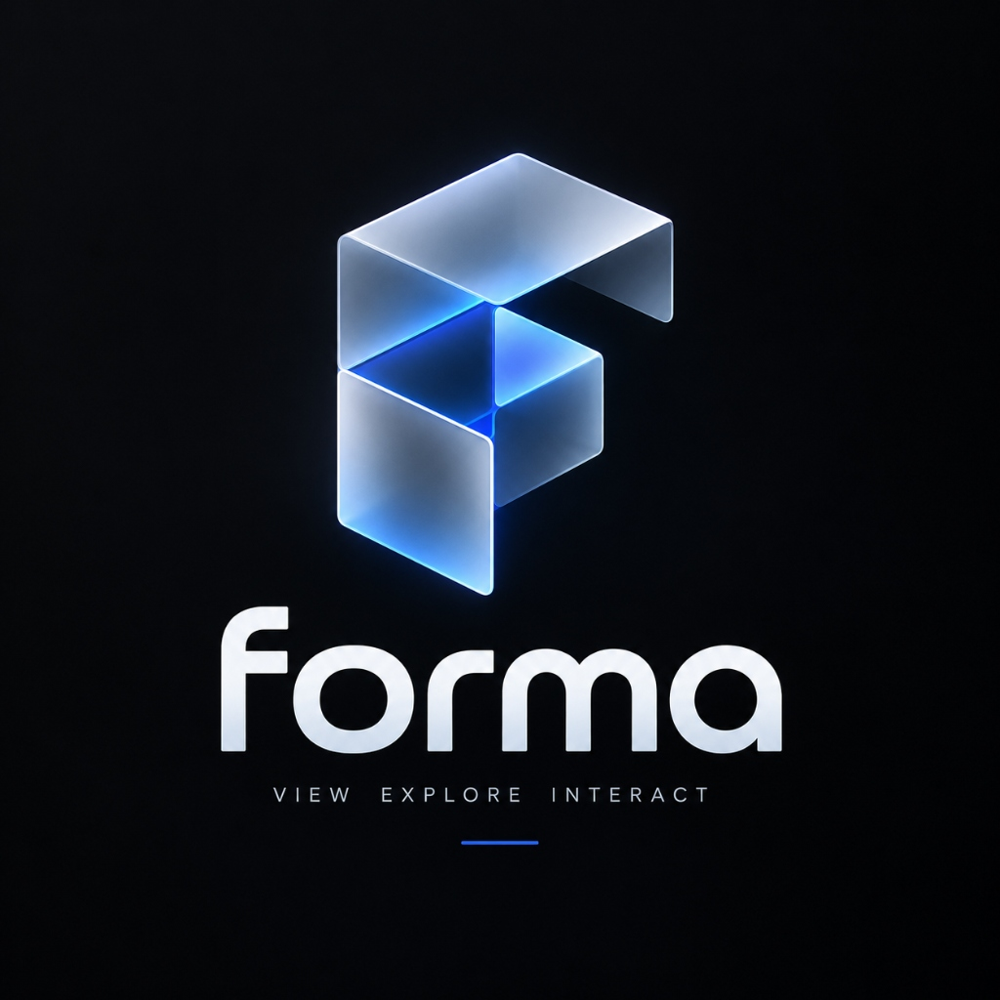
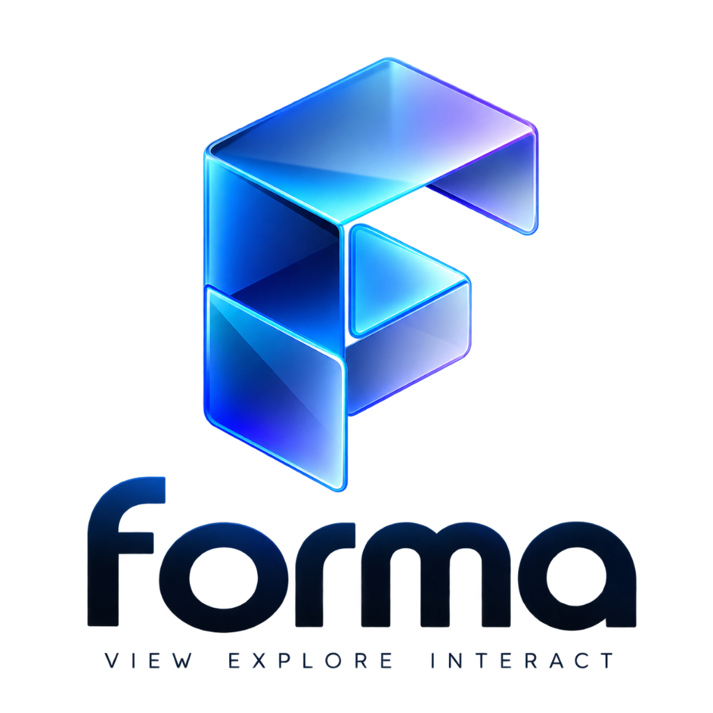

#  FORMA — High-Performance 3D Product Configurator

[](https://vitejs.dev/)
[](https://react.dev/)
[](https://threejs.org/)
[](https://tailwindcss.com/)
[](LICENSE)

**FORMA** is an ultra-fast, production-grade 3D product configurator and interactive showcase for modern footwear and industrial design. Built with React 19, Vite, Three.js (via React Three Fiber & Drei), Framer Motion, and Tailwind CSS v4.

---

## 📸 Brand Visuals & Screenshots

<p center="align">
  
  
</p>

### Key Features

- 👟 **Procedural & Custom 3D Models** — Instantly customize built-in high-fidelity procedural geometry or drag-and-drop your own `.glb`/`.gltf` 3D model files with automatic scale normalization and bounding alignment.
- 🎨 **Real-time Material Engine** — Customize colors, leather/matte/metallic physical finishes, sole tread patterns, and physical glass transmission materials with live feedback.
- ⚡ **60 FPS Performance Optimization Engine** — Built with dynamic resolution scaling (`PerformanceMonitor`), corner smoothness reduction, frame-capped contact shadows, and shadow map bias tuning to run lag-free on high-DPI displays and mobile GPUs.
- 📷 **Smooth Camera Rigging** — Interactive 360° orbit control with smooth camera easing between Front, Side, Top, and Detail preset angles.
- 💾 **Design Archive & Local Storage** — Save customized builds to a local browser archive, complete with timestamps, swatch previews, and one-click restoration.
- 📄 **Specification Sheet & Export** — Detailed breakdown of active materials, color codes, components, weight, and pricing.
- 📱 **Mobile-First Sheet Drawer** — Responsive touch-friendly mobile controls designed specifically for mobile viewports.

---

## ⚡ 3D Performance Optimizations

To ensure zero lag and maintain a locked 60 FPS experience across high-res displays and lower-spec GPUs, FORMA integrates several performance optimization techniques:

1. **Adaptive DPR (`PerformanceMonitor`)** — Dynamically adjusts device pixel ratio (`dpr={dpr}`) between `1.0x` and `1.5x` based on real-time FPS performance.
2. **Subdivision Optimization** — Optimized `RoundedBox` geometry smoothness parameters (`smoothness={2}`) reducing scene polygon count by over 75% without visual loss of detail.
3. **Frame-Capped Contact Shadows** — Configured `ContactShadows` to `frames={1}` with 256px resolution to eliminate continuous frame-by-frame shadow map redraw overhead.
4. **Physical Transmission Tuning** — Optimized Physical Material refraction thickness, roughness, and opacity settings for GPU-friendly shader rendering.
5. **Selective Shadow Casting** — Traverses custom `.glb` models to bypass shadow casting on sub-90% opacity or transparent sub-meshes.

---

## 🚀 Getting Started

### Prerequisites

- Node.js 18+ and `npm` installed on your machine.

### Installation

1. **Clone the repository:**
   ```bash
   git clone https://github.com/GaneshRamesh2004/FORMA.git
   cd FORMA
   ```

2. **Install dependencies:**
   ```bash
   npm install
   ```

3. **Start the local development server:**
   ```bash
   npm run dev
   ```
   Open your browser at `http://localhost:5173/`.

---

## 🛠️ CLI Scripts

| Command | Action |
|---|---|
| `npm run dev` | Launch local Vite development server |
| `npm run build` | Bundle production build into `dist/` |
| `npm run preview` | Serve the production build locally for verification |
| `npm run lint` | Execute `oxlint` for fast code linting |

---

## 📁 Repository Structure

```
FORMA/
├── public/                  Static logo assets & favicon
│   ├── logo-light.png       Light brand logo visual
│   └── logo-dark.jpg        Dark brand logo visual
├── docs/screenshots/        Documentation preview assets
├── src/
│   ├── components/          UI components (Header, BrandPanel, ControlPanel, Archive, etc.)
│   ├── context/             ProductProvider for global state
│   ├── data/                Color palettes, material attributes, and product specifications
│   ├── hooks/               useProductConfig, useArchive, useCustomModel
│   ├── pages/               Configurator, Specification, and Archive pages
│   ├── scene/               Three.js / R3F scene, Sneaker, CustomModel, CameraRig, Ground
│   ├── App.jsx              App routing & loading screen orchestration
│   ├── main.jsx             React entrypoint
│   └── index.css            Tailwind CSS v4 theme design tokens
├── package.json             Project dependencies and npm scripts
└── vite.config.js           Vite bundle configuration & React plugin
```

---

## 🧰 Tech Stack

- **Framework:** [React 19](https://react.dev/) + [Vite 8](https://vitejs.dev/)
- **3D Graphics:** [Three.js](https://threejs.org/) + [@react-three/fiber](https://docs.pmnd.rs/react-three-fiber) + [@react-three/drei](https://github.com/pmndrs/drei)
- **Styling & UI:** [Tailwind CSS v4](https://tailwindcss.com/) + [Framer Motion](https://www.framer.com/motion/)
- **Linting:** [Oxlint](https://github.com/oxc-project/oxc)

---

## 📜 License

Distributed under the MIT License. See `LICENSE` for details.
